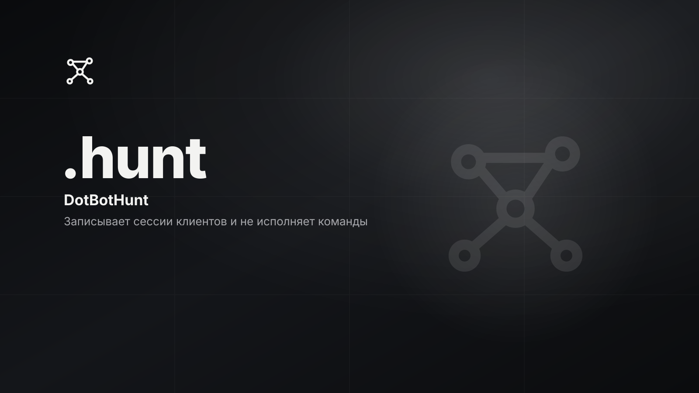

# DotBotHunt

<p>
  
  
  
  <!-- loc:start --><!-- loc:end -->
</p>



<!-- audit:start -->
<p>
  <a href="docs/audit/latest.md"></a>
  <a href="docs/audit/2026-10-02-clear-ledger.md"></a>
</p>
<!-- audit:end -->

DotBotHunt поднимает SSH, HTTP, telnet, FTP, SMTP и redis на высоких портах и пишет, что прислал клиент. Ответы выглядят как успех, строки клиента не исполняются. Страна берётся из DNS Team Cymru. Город и провайдер запрашиваются только при ключе ip-api Pro, по HTTPS.

## Запуск

```bash
uv sync --frozen --extra dev
uv run --frozen honeybot run
```

Если `config.toml` нет, CLI читает `config.example.toml`. Ключи пиши в `config.toml`: файл в `.gitignore` и `.dockerignore`.

Слушатели на `0.0.0.0`: SSH 2222, HTTP 8080, telnet 2323, FTP 2121, SMTP 2525, redis 6379. Панель статистики: http://127.0.0.1:8787. База по умолчанию: `data/honeybot.db`.

### Docker

```bash
docker build --pull -t honeybot:ci .
```

Образ `python:3.12.15-slim-bookworm`, пользователь `honey` (uid 10001), команда `honeybot run`. В образ копируется `config.example.toml`, не `config.toml`. Порт панели не публикуется.

## Команды

| Команда | Назначение |
|---------|------------|
| `uv sync --frozen --extra dev` | окружение по `uv.lock`, с dev-зависимостями |
| `uv run --frozen honeybot run` | поднять приманку |
| `uv run --frozen honeybot stats` | сводка по базе |
| `uv run --frozen honeybot session <id>` | одна сессия |
| `uv run --frozen honeybot export <path>` | сводка в JSON |
| `uv run --frozen honeybot rebuild` | заново проставить метки сессий |
| `honeybot --config <path>` | конфиг, по умолчанию `config.toml` |
| `honeybot --db <path>` | файл SQLite, по умолчанию `data/honeybot.db` |
| `uv run --frozen pytest -q` | тесты, как в CI |
| `docker build --pull -t honeybot:ci .` | образ, как в CI |

## Стек

<p>
  
  
  
  
  
  
  
  
  
  
</p>

## Тесты

```bash
uv run --frozen pytest -q
```

Отдельного lint или typecheck в репозитории нет. CI на ветке `master` ставит `uv==0.9.15`, выполняет `uv sync --frozen --extra dev`, затем `uv run --frozen pytest -q` и `docker build --pull -t honeybot:ci .`.

## Архитектура

Пакет `honeybot` на asyncio. `cli` грузит конфиг и либо поднимает приманку, либо читает SQLite офлайн. Слушатели пишут события в `store`. Ответы собирает `reply` через файловую систему в памяти (`vfs`). Обогащение IP идёт очередью в `enrich`. `reconstruct` ставит метки сессии. Панель читает ту же базу и слушает только localhost.

```
src/honeybot/
├── cli.py
├── app.py
├── config.py
├── store.py
├── enrich.py
├── dashboard.py
├── reconstruct.py
├── reply.py
├── vfs.py
├── report.py
├── rules.toml
└── listeners/
    ├── ssh.py
    ├── http.py
    └── line.py
```

- **Не исполняет ввод.** Команды, HTTP и строки протоколов пишутся в SQLite. `eval`, `exec` и `subprocess` в пакете запрещены тестом.
- **Сеть наружу только для обогащения.** DNS: Team Cymru и Spamhaus. Город и ISP: HTTPS `pro.ip-api.com`, только если задан `ip_api_key`. AbuseIPDB: только если задан `abuseipdb_api_key`. `urllib` разрешён только в `enrich.py`.
- **Панель локальная.** `dashboard.host` может быть только `127.0.0.1`.
- **Высокие порты.** Слушатели на `0.0.0.0`. Файрвол программа не меняет.
- **Секреты вне репозитория.** `config.toml` не коммитится и не копируется в образ.

## Лицензия

© 2026 DotCore. Все права защищены.

Проприетарный код. Использование, копирование, изменение и распространение запрещены без письменного разрешения автора. Исходный код открыт только для ознакомления. См. [LICENSE](LICENSE).
